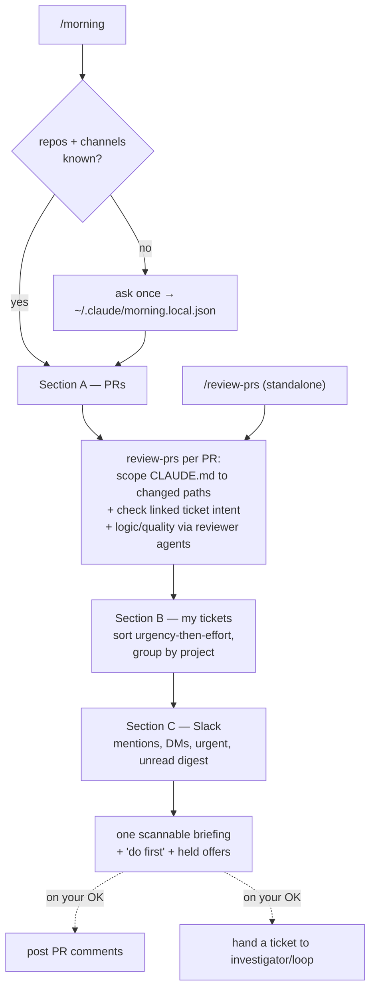

# claude-morning

Two Claude Code skills for the start of the day:

- **`morning`** — one command (*"do my morning routine"* / `/morning`) that pulls the three things you wake up to and triages each: the **PRs** in your repos that aren't yours to review, the **tickets** assigned to you (sorted urgency-then-effort so urgent items and quick wins surface first, grouped by project), and **Slack** (mentions, DMs, urgent threads, a compact unread digest). One scannable briefing, urgent-first, with a "do first" line at the bottom.
- **`review-prs`** — a standalone reviewer (*"review all PRs"* / *"review this PR: <url>"* / `/review-prs`) that checks a PR against the project's own **`CLAUDE.md`** (root **and** the per-app/nested ones that govern the changed files), against what its **linked ticket** asked for, and for plain **logic and quality** bugs — then leaves short, human review comments. The morning routine uses it for its PR section.

## How it works

Both run in the **main thread** (no browser, no unattended subagent) so they can read your live session, ask the occasional first-run question, and — critically — **confirm before any comment is posted to a colleague's PR**. The only thing either skill writes is a PR review comment, and that's held for your OK by default.



`review-prs` reuses your existing `frontend-reviewer` / `backend-reviewer` / `security-reviewer` agents (and the `code-review` skill) as the quality engine where they're installed, and adds the two things they don't do: the **CLAUDE.md-rule** pass scoped to each changed file's rule ancestry, and the **ticket-intent** cross-check. `morning` reuses `review-prs` for PRs, the `ticket` skill's saved tracker mapping for tickets, and can hand a chosen ticket to the **investigator** / `loop-engine` to actually run.

## What you get

| Piece | Role |
|-------|------|
| `skills/morning/SKILL.md` | The conductor: resolve config → PRs (via review-prs) → tickets (sorted) → Slack → one briefing |
| `skills/review-prs/SKILL.md` | The reviewer: resolve targets → scope CLAUDE.md to changed paths → check ticket intent → logic/quality → draft → confirm → post comments |
| `install.sh` | Symlinks both skills into `~/.claude/skills/` and checks for `gh` + tracker + Slack MCPs |

## Install — send this README to Claude Code

You don't run anything by hand. Paste this file (or its URL) into Claude Code and say *"install this"*.

> **🤖 Claude Code — if a user sent you this README, install the skills now. Do not ask for repo/channel details (those are gathered on the first `/morning`, not at install). Steps:**
>
> 1. **Preflight.** Confirm `git`, the `claude` CLI, and `gh` are on PATH. If `git`/`claude` are missing, stop and tell the user. If `gh` is missing, install it (`brew install gh`) and note they'll need `gh auth login`.
> 2. **Clone (idempotent):**
>    ```bash
>    git clone https://github.com/unisol1020/claude-tools.git ~/.claude-tools 2>/dev/null \
>      || git -C ~/.claude-tools pull --ff-only
>    ```
> 3. **Run the installer:**
>    ```bash
>    bash ~/.claude-tools/morning/install.sh
>    ```
>    It symlinks the `morning` and `review-prs` skills into `~/.claude/skills/` and checks for `gh`, a tracker (Linear/Jira), and a Slack MCP.
> 4. **Verify:** `ls -la ~/.claude/skills/morning ~/.claude/skills/review-prs` are symlinks into `~/.claude-tools/morning`.
> 5. **Report back to the user** — confirm it's installed, then explain briefly (paraphrase, keep it short):
>
>    > ✅ **Installed.** Restart Claude Code once so the skills load.
>    >
>    > **How to use:**
>    > 1. Make sure `gh` is authenticated (`gh auth login`), and connect a **Linear/Jira** MCP and a **Slack** MCP for the full briefing (claude.ai integrations, or `claude mcp add`).
>    > 2. Say *"do my morning routine"* or `/morning` — first run I ask once which repos to scan + which Slack channels matter, then remember it in `~/.claude/morning.local.json`.
>    > 3. Or review on demand: *"review all PRs"*, *"review this PR: <url>"*, or `/review-prs`.
>    > 4. I check PRs against your project's `CLAUDE.md` + the linked ticket + logic/quality, and **show you the comments before posting** (nothing public until you OK it).
>    >
>    > Try: *"do my morning routine"*.
>
> Update later with `git -C ~/.claude-tools pull` (the symlinks pick it up). Uninstall: see the bottom of this file.

### Manual install (if you'd rather)

```bash
git clone https://github.com/unisol1020/claude-tools.git ~/.claude-tools
~/.claude-tools/morning/install.sh
```
Then restart Claude Code.

## Requirements

[Claude Code](https://claude.com/claude-code), `git`, and an authenticated **`gh` CLI** (for PR review). For the full morning briefing also connect a **Linear** or **Atlassian (Jira)** MCP (the "my tickets" section) and a **Slack** MCP (the Slack section) — each section degrades to a one-line "not connected" note if its MCP is absent, so the rest of the briefing still runs.

## Use it

```text
do my morning routine          # the full briefing
morning briefing for org/web   # scope to one repo
review all PRs                 # every open PR in the current repo not authored by you
review this PR: https://github.com/org/web/pull/214
review PRs not assigned to me in org/api
```

- **First `/morning`** asks once which repos to scan and which Slack channels matter, then remembers it in `~/.claude/morning.local.json`. It reuses your `ticket` skill's tracker mapping (`.claude/tickets.local.json`) — no re-asking.
- **PR comments are held for your OK.** `review-prs` shows the drafted comments and posts only after you confirm. You *can* set `review.postMode` to `"auto"` in `~/.claude/morning.local.json`, but understand what it removes: `auto` drops the only human gate and posts AI-drafted comments publicly to colleagues' PRs unattended — the risk is on you, the same way pointing QA at a non-localhost target is. Even then the bulk "review all PRs" path keeps one batch confirmation; only single-PR review posts with no prompt.
- **Right rules for the right code.** A change under `apps/admin/` is judged against root `CLAUDE.md` *and* `apps/admin/CLAUDE.md`; a change under `apps/api/` against root *and* `apps/api/CLAUDE.md` — never another app's rules.

## Per-machine config

Repos, Slack channels, and the post mode live in `~/.claude/morning.local.json` (machine-level — they follow you, not a repo). The skills write and read it for you; change your mind by editing the file. It holds no secrets. `declined` is remembered so a section never re-asks.

## Uninstall

```bash
rm ~/.claude/skills/morning ~/.claude/skills/review-prs
rm -rf ~/.claude-tools   # only if nothing else in this repo is installed
```
